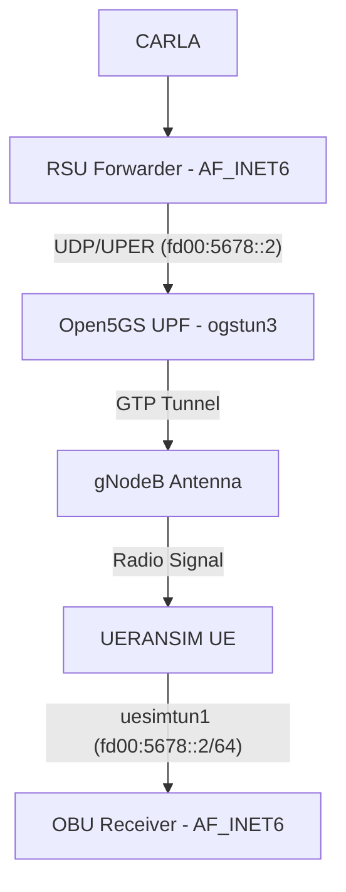

# Dual-Path V2X: C-V2X + 5G Network Slicing — Conecta2030

> Documento criado em 31/03/2026. Atualizado em 22/04/2026 para IPv6 Dual-Stack.

---

## 1. Plano

### Objetivo
Manter a comunicação C-V2X (DSRC/WSMP via hardware Commsignia) funcionando,
**e adicionar** um caminho paralelo via 5G Network Slicing (SST=2, DNN=v2x).

**Migração IPv6 (Abril/2026):** Toda a arquitetura do Path 2 (5G) foi migrada
para **IPv6 dual-stack** usando o prefixo **ULA `fd00:5678::/64`**. O UERANSIM
não suporta PDU Sessions IPv6 nativas, então usamos um **IPv6 Overlay** manual
na interface `uesimtun1`. O transporte GTP permanece IPv4 (transparente).

### Arquitetura Dual-Path (IPv6 Dual-Stack)

```
                                      ┌───────────────────────────────────────────────┐
                                      │         PATH 1: C-V2X (DSRC) — sem mudanças  │
                                      │                                               │
                     ┌────────────────┤  RSU (fac_alert.c)                            │
                     │  TCP:8080       │  JSON → UPER → WSMP (rádio 5.9GHz)           │
                     │  JSON V2X       │                 │                             │
                     │                 └─────────────────┼────────────────────────────-┘
                     │                                   │ DSRC
┌────────────────┐   │                                   ▼
│     CARLA       │   │                 ┌────────────────────────────────────────────┐
│ manual_control_ │   │                 │  OBU (obu_alert_server.c) — sem mudanças  │
│ steeringwheel   │ ──┤                 │  recebe via WSMP RX (rádio)               │──→ Tablet
│                 │   │                 └────────────────────────────────────────────┘
│ SocketSender    │   │
│ (TCP, existente)│   │
│       +         │   │                 ┌───────────────────────────────────────────────┐
│ UDPSender (NOVO)│   │                 │   PATH 2: 5G SLICE (SST=2) — IPv6 Dual-Stack │
└────────────────┘   │  UDP:9090       │                                               │
                     └────────────────→│  rsu_5g_forwarder.py (AF_INET6 dual-stack)   │
                       JSON V2X        │  JSON → UPER (j2735_codec.py / pycrate)      │
                                      │         │                                     │
                                      │         ▼ UDP IPv6 (fd00:5678::2)             │
                                      │   ┌──────────────────────────────────┐        │
                                      │   │   Open5GS 5G Core              │        │
                                      │   │   UPF (ogstun3)  → gNB → UE   │        │
                                      │   │   Slice: SST=2, DNN=v2x       │        │
                                      │   │   IPv6: fd00:5678::/64 (ULA)   │        │
                                      │   │   IPv4: 192.168.200.0/24 (leg) │        │
                                      │   │   NAT66: ip6tables MASQUERADE  │        │
                                      │   └──────────────────────────────────┘        │
                                      │         │                                     │
                                      │         ▼ IPv6 Overlay (uesimtun1)            │
                                      │   obu_5g_receiver.py (AF_INET6 dual-stack)   │
                                      │   UPER → JSON (j2735_codec.py) ──→ Tablet     │
                                      └───────────────────────────────────────────────┘
```


### Infraestrutura 5G já existente no core

| Componente | Config V2X (IPv4+IPv6 Dual-Stack) |
|-----------|-----------------------------------|
| AMF | `s_nssai: sst: 2, sd: 000001` |
| SMF | `dnn: v2x, subnet: 192.168.200.0/24 + fd00:5678::/64, sst: 2, sd: 000001` |
| UPF | `dnn: v2x, subnet: 192.168.200.0/24 + fd00:5678::/64 (ogstun3)` |
| gNB | `slices: sst: 0x2, sd: 0x000001` |
| UE4 | `apn: v2x, sst: 2` — PDU Session V2X |
| NAT66 | `ip6tables -t nat -A POSTROUTING -s fd00:5678::/64 -o eth0 -j MASQUERADE` |
---

## 2. O que foi feito

### 2.1 Backups criados

| Arquivo original | Backup |
|-----------------|--------|
| `carla/carla-windows/PythonAPI/examples/manual_control_steeringwheel.py` | `.bak` |

### 2.2 Arquivos novos criados

| Arquivo | Descrição |
|---------|-----------|
| `rsu_5g_forwarder.py` | Proxy no lado da infraestrutura. Recebe JSON V2X do CARLA via **UDP**, codifica em **ASN.1 UPER** (J2735) e encaminha via UDP para o OBU pela rede 5G |
| `obu_5g_receiver.py` | Roda ao lado do `obu_alert_server` existente no UE/OBU. Recebe **UPER** via UDP:9090, decodifica para **JSON** e faz broadcast para tablets via TCP:8081 |
| `j2735_codec.py` | Módulo compartilhado de encoding/decoding ASN.1 UPER usando **pycrate** + schema **J2735-202409** (SAE) |
| `test_5g_v2x.py` | Ferramenta de teste para validar a comunicação 5G sem precisar do CARLA |
| `ipv6_nat_manager.py` | **[NOVO - IPv6]** Gerenciador centralizado de NAT66, discovery de UE IPv6, e verificação de conectividade end-to-end |


### 2.3 Arquivos modificados

| Arquivo | Mudança |
|---------|---------|
| `manual_control_steeringwheel.py` | Adicionada classe `UDPSender` e lógica de dual-path no game_loop. O CARLA agora envia para AMBOS os caminhos (TCP→RSU e UDP→5G) |

---

## 3. Como usar

### 3.1 Pré-requisitos
1. Core 5G Open5GS rodando (todos os containers)
2. gNB conectado ao AMF
3. UE registrado com PDU Session V2X ativa (SST=2, DNN=v2x)
4. Subscriber cadastrado no WebUI com slice SST=2
5. **Python 3.10+** com `pycrate` e `j2735_202409` instalados:

```bash
# Instalar dependências UPER:
pip3 install pycrate

# Clonar o j2735decoder para obter o schema J2735:
git clone --depth 1 https://github.com/usdot-fhwa-stol/j2735decoder.git /tmp/j2735decoder
pip3 install /tmp/j2735decoder/wheels/j2735_202409-0.1.0-py3-none-any.whl
```

### 3.2 Verificar PDU Session V2X no UE (IPv4 + IPv6)

```bash
# No container do UE (UERANSIM):
docker exec -it nr_ue bash
ip addr show uesimtun1
# Verificar:
#   - IPv4 na faixa 192.168.200.x (atribuído pelo Open5GS)
#   - IPv6 fd00:5678::2/64 (configurado pelo overlay em ueransim-ue_init.sh)

# Testar conectividade IPv6:
ping6 -c 3 fd00:5678::1  # gateway UPF
```

### 3.3 Roteamento (IPv4 + IPv6)

```bash
# No host Docker — rotas IPv4 (legado) e IPv6 para a subnet V2X via UPF:
sudo ip route add 192.168.200.0/24 via 172.22.0.8
sudo ip -6 route add fd00:5678::/64 via <UPF_IPv6_ON_DOCKER_NET>

# Ou usar o ipv6_nat_manager.py para configurar automaticamente:
python3 ipv6_nat_manager.py --action setup

# No PC do CARLA (se separado):
sudo ip route add 192.168.200.0/24 via <IP_HOST_DOCKER>
```

### 3.4 Registrar subscriber no WebUI (passo 4.5 do plano)

Acessar `http://<DOCKER_HOST>:9999` (login: admin/1423) e garantir que o UE4
(IMSI `999400000000006`) tenha a slice V2X configurada:

1. Ir em **Subscriber** → localizar o IMSI ou criar novo
2. Em **Slice Configuration**, adicionar:
   - **SST**: 2
   - **SD**: 000001
   - **Session / DNN**: v2x
      - **Type**: IPv4v6 (dual-stack)
3. Salvar

> Sem isso, o UE não conseguirá estabelecer a PDU Session V2X e não
> receberá IP na faixa `192.168.200.x` / `fd00:5678::/64`.

### 3.5 Iniciar o PATH 2 (5G)

```bash
# Terminal 1 — OBU 5G Receiver (no container UE ou host com acesso ao tunnel):
python3 obu_5g_receiver.py --v2x-port 9090 --tablet-port 8081

# Terminal 2 — RSU 5G Forwarder (no host Docker, recebe UDP do CARLA e reencaminha):
python3 rsu_5g_forwarder.py --obu-ip fd00:5678::2 --listen-port 9090 --obu-port 9090
```

### 3.6 Iniciar o sistema completo (ambos os paths)

```bash
# Terminal 1 — RSU C-V2X (hardware Commsignia, igual antes):
ssh root@192.168.0.56
cd /tmp && ./fac_alert_server <CARLA_IP>

# Terminal 2 — OBU C-V2X (hardware Commsignia, igual antes):
ssh root@192.168.0.53
cd /tmp && ./obu_alert_server

# Terminal 3 — RSU 5G Forwarder:
python3 rsu_5g_forwarder.py --obu-ip fd00:5678::2

# Terminal 4 — OBU 5G Receiver:
python3 obu_5g_receiver.py

# Terminal 5 — CARLA (agora envia para ambos):
python manual_control_steeringwheel.py --host <CARLA_SERVER> --v2x-5g-ip <RSU_5G_FORWARDER_IP>
```

### 3.7 Testar e Simular Auto-Deploy (PATH 2 - 5G)

Para testar a arquitetura 5G Slicing de forma rápida, sem depender do ambiente pesado 3D do CARLA e sem precisar iniciar cada módulo manualmente, criamos um script de automação (`test_5g.py`).

Esse script executa o **OBU 5G Receiver**, o **RSU 5G Forwarder** e um **Simulador CARLA 5G Interativo**, cada um em sua própria janela de terminal:

```bash
# Iniciar a simulação completa do PATH 2 (5G)
python3 test_5g.py
```

Na janela do **Simulador CARLA 5G**, você pode enviar mensagens de teste:
- `send bsm` - Envia uma mensagem BasicSafetyMessage.
- `send psm` - Envia uma mensagem PersonalSafetyMessage.
- `auto spat 1.0` - Inicia envio de SPaT a cada 1 segundo.
- `stop` - Para o envio automático.

---

## 4. Notas técnicas

- **Path 1 (C-V2X)** permanece 100% inalterado. O `fac_alert.c` e `obu_alert_server.c` continuam funcionando como antes.
- **Path 2 (5G)** agora usa **ASN.1 UPER** (encoding J2735 via pycrate) — conforme recomendação SAE para transporte de mensagens V2X.
- O encoding UPER é feito no `rsu_5g_forwarder.py` (JSON→UPER) e o decoding no `obu_5g_receiver.py` (UPER→JSON).
- O module `j2735_codec.py` é compartilhado entre ambos.
- Se pycrate/j2735 não estiverem instalados, os scripts operam em **fallback JSON puro** automaticamente.
- O OBU 5G Receiver usa porta TCP **8081** para não conflitar com o OBU C-V2X (8080).
- O argumento `--v2x-5g-ip` no CARLA é **opcional**. Sem ele, funciona somente C-V2X.
- Flag `--no-uper` no forwarder desabilita UPER e envia JSON puro.
- O primeiro startup do forwarder/receiver demora ~2 min (compilação do schema ASN.1).

---

## 5. Evolução: Arquitetura de Isolamento (Real Slicing - 01/04/2026)

Para garantir que o tráfego passe obrigatoriamente pela UPF e não via loopback, a arquitetura foi refinada:

### Topologia de Isolamento


### Mudanças Implementadas:
1. **Network Namespace Isolation**: O `OBU Receiver` agora roda dentro do namespace de rede do rádio (`nr_ue`).
2. **Injeção via nsenter**: Uso de `nsenter -t <PID> -n` para cruzar a barreira de rede sem instalar dependências no container.
3. **Automated Orchestration**: O script `test_5g.py` foi atualizado para gerenciar os containers Open5GS e configurar rotas estáticas automaticamente.

---

*Documento atualizado em 22/04/2026 — Migração IPv6 Dual-Stack concluída*
---

## 6. Migração IPv6 Dual-Stack (22/04/2026)

### 6.1 Motivação
A arquitetura original usava exclusivamente IPv4 para toda a comunicação V2X.
A migração para IPv6 dual-stack garante:
- **Compatibilidade futura** com redes 5G que exigem IPv6 nativo
- **Endereçamento escalável** via prefixo ULA `fd00:5678::/64`
- **Backward-compatibility** com componentes legados (CARLA) via IPv4-mapped addresses

### 6.2 Abordagem: IPv6 Overlay
Como o UERANSIM não suporta PDU Sessions IPv6 nativas, implementamos um **overlay manual**:
1. O transporte GTP subjacente permanece IPv4 (transparente)
2. Após a sessão PDU ser estabelecida, o `ueransim-ue_init.sh` configura manualmente `fd00:5678::2/64` na interface `uesimtun1`
3. O UPF (`ogstun3`) recebe o endereço `fd00:5678::1/64` como gateway

### 6.3 Componentes Modificados

| Camada | Componente | Mudança |
|--------|-----------|---------|
| Core 5G | SMF/UPF | Subnets IPv6 adicionadas ao DNN `v2x` |
| Core 5G | UPF init | `ogstun3` configurado com range IPv6 ULA |
| Core 5G | sa-deploy.yaml | IPv6 forwarding + Docker dual-stack network |
| RAN | nr-ue-slicing.yaml | Sysctls IPv6 habilitados |
| RAN | ueransim-ue_init.sh | Overlay `fd00:5678::2/64` na `uesimtun1` |
| App | rsu_5g_forwarder.py | Sockets `AF_INET6` dual-stack |
| App | obu_5g_receiver.py | Sockets `AF_INET6` dual-stack |
| App | test_5g.py | Orquestração com discovery IPv6 e NAT66 |
| Util | ipv6_nat_manager.py | NAT66 setup, UE discovery, verificação |

### 6.4 Endereçamento

| Entidade | IPv4 (legado) | IPv6 (novo) |
|----------|--------------|-------------|
| UPF (ogstun3 gateway) | 192.168.200.1 | fd00:5678::1 |
| OBU/UE (uesimtun1) | 192.168.200.2 | fd00:5678::2 |
| Prefixo V2X | 192.168.200.0/24 | fd00:5678::/64 |

### 6.5 Verificação

```bash
# 1. Verificar overlay IPv6 no UE:
docker exec nr_ue ip -6 addr show uesimtun1

# 2. Verificar NAT66 no UPF:
python3 ipv6_nat_manager.py --action verify

# 3. Testar conectividade end-to-end:
docker exec nr_ue ping6 -c 3 fd00:5678::1

# 4. Executar simulação completa:
python3 test_5g.py
```